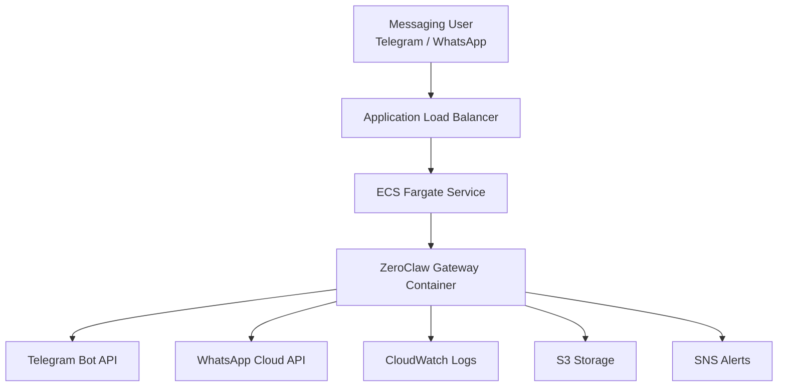

---


---


# Project Overview

This project deploys the **ZeroClaw AI Gateway** on **AWS ECS Fargate** using **Terraform Infrastructure as Code**.

ZeroClaw acts as an **AI gateway platform** that connects messaging platforms such as **Telegram and WhatsApp** to AI agents through a centralized API gateway.

The goal of this project is to demonstrate a **production-style cloud deployment workflow**, including container orchestration, networking, load balancing, and monitoring.

---

# Architecture Diagram



---

# High Level Infrastructure


---

# AWS Services Used

| Service                   | Purpose                             |
| ------------------------- | ----------------------------------- |
| ECS Fargate               | Run containerized ZeroClaw gateway  |
| Application Load Balancer | Public entry point for HTTP traffic |
| VPC                       | Isolated network environment        |
| Security Groups           | Control inbound/outbound traffic    |
| CloudWatch Logs           | Container logging and monitoring    |
| S3                        | Storage for application data        |
| SNS                       | Alert notifications                 |

---

# Project Structure

```
ZeroClaw/
│
├── main.tf
├── variables.tf
├── outputs.tf
│
└── README.md
```

---

# Prerequisites

Install the following tools before deploying.

```
Terraform
AWS CLI
Docker
Git
```

Configure AWS credentials:

```bash
aws configure
```

---

# Deployment Steps

## 1 Clone the repository

```bash
git clone https://github.com/YOUR_USERNAME/zeroclaw-deployment.git
cd zeroclaw-deployment
```

---

## 2 Initialize Terraform

```bash
terraform init
```

---

## 3 Validate the configuration

```bash
terraform validate
```

---

## 4 Format Terraform code

```bash
terraform fmt
```

---

## 5 Deploy the infrastructure

```bash
terraform apply
```

Type:

```
yes
```

Terraform will provision all AWS resources automatically.

---

# Deployment Output

After deployment Terraform returns important outputs.

Example:

```
alb_dns_name = zeroclaw-alb-1636011536.eu-central-1.elb.amazonaws.com
ecs_cluster_name = zeroclaw-cluster
ecs_service_name = zeroclaw-service
s3_bucket_name = zeroclaw-storage-unique-2026
sns_topic_arn = arn:aws:sns:eu-central-1:xxxx:zeroclaw-alerts
```

---

# Test the Deployment

Verify the service health:

```bash
curl http://ALB_DNS/health
```

Expected response:

```json
{
 "status": "ok",
 "paired": true
}
```

This confirms:

• ECS service is running
• ZeroClaw container started successfully
• Gateway is operational

---

# Connecting a Telegram Bot

1 Open Telegram
2 Search for **BotFather**
3 Create a bot

```
/start
/newbot
```

BotFather will provide a token.

Example:

```
123456:ABC-DEF1234ghIkl-zyx57W2v1u123ew11
```

Add this token to the ECS container environment variables.

Example Terraform configuration:

```
environment = [
  {
    name  = "TELEGRAM_BOT_TOKEN"
    value = "YOUR_BOT_TOKEN"
  }
]
```

Redeploy:

```
terraform apply
```

Your bot will now respond through ZeroClaw.

---

# Monitoring and Logs

View container logs with AWS CLI:

```
aws logs tail /ecs/zeroclaw --follow
```

Check ECS task status:

```
aws ecs describe-tasks
```

Check ECS service events:

```
aws ecs describe-services
```

---

# Hands-On Experience

During this project I gained practical experience in several key cloud engineering areas.

## Infrastructure as Code

Implemented complete infrastructure provisioning using **Terraform**, including:

• ECS clusters
• ECS task definitions
• Application Load Balancers
• VPC networking
• Security groups

This allowed infrastructure to be **version controlled and reproducible**.

---

## Container Orchestration

Deployed the ZeroClaw container from GitHub Container Registry.

```
ghcr.io/zeroclaw-labs/zeroclaw:latest
```

The container runs on **AWS ECS Fargate**, which eliminates the need to manage EC2 instances.

---

## Networking and Load Balancing

Configured an **Application Load Balancer** to route external traffic to the ECS service.

This included:

• Target groups
• health checks
• security group rules

---

## Observability

Integrated **CloudWatch Logs** for container monitoring.

This enabled real-time debugging of:

• container startup
• service failures
• gateway runtime status

---

## Troubleshooting ECS Deployments

While deploying this project I resolved multiple infrastructure issues including:

• Terraform configuration errors
• ECS task definition misconfigurations
• IAM role permissions
• container startup failures

These issues were diagnosed using:

```
aws ecs describe-services
aws ecs describe-tasks
aws logs tail
curl /health
```

---

# Skills Demonstrated

This project demonstrates the following skills:

Cloud Infrastructure
Terraform IaC
AWS ECS Fargate
Container deployment
Load balancing
Cloud networking
Logging and monitoring
API integration

---

# Future Improvements

Potential enhancements for this project:

• Add HTTPS using AWS ACM
• Implement CI/CD pipeline (GitHub Actions)
• Enable ECS auto scaling
• Add Redis caching layer
• Add centralized metrics with Prometheus
• Deploy using multi-environment Terraform modules

---

# Author

Elizabeth Gyamfi

Cloud Engineering / DevOps Portfolio Project
